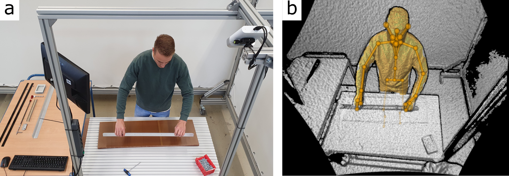
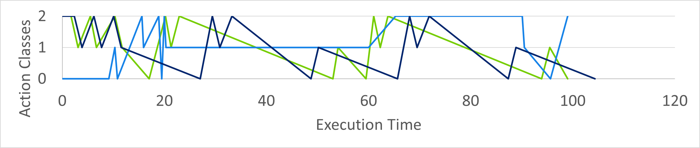

# MTMAssemblyStepEstimation
A Methods-Time-Measurement Based Approach To Enable Action Recognition for Multi-Variant Assembly in Human-Robot Collaboration

## Introduction
This repository contains an early version of an assembly step estimation based on methods-time-measurement methods. However, this repository does not contain a ready-made package that can be integrated into other systems, but rather makes the code that was created in the course of the publication mentioned below available to the research community in order to gain further insight into our work.

## Related Publication and Citation
This repository serves as a complement for the following paper. Please cite this [paper]() if you use this repository in your research.

```
@article{Koch.2022,
title = {A Methods-Time-Measurement based Approach to enable Action Recognition for Multi-Variant Assembly in Human-Robot Collaboration},
journal = {Procedia CIRP},
volume = {106},
pages = {233-238},
year = {2022},
note = {9th CIRP Conference on Assembly Technology and Systems},
issn = {2212-8271},
doi = {https://doi.org/10.1016/j.procir.2022.02.184},
url = {https://www.sciencedirect.com/science/article/pii/S2212827122001858},
author = {Koch, Julian and B{\"u}sch, Lukas and Gomse, Martin and Sch{\"u}ppstuhl, Thorsten},
keywords = {Assembly, Human Action Recognition, Assembly Step Recognition, Human-Robot Collaboration, Industry 4.0, Methods-Time-Measurement, Azure Kinect, Skeleton Based Action Recognition, Particle Swarm Optimization, Artificial Neural Network}
}
```

## Abstract
Action Recognition (AR) has become a popular approach to ensure efficient and safe Human-Robot Collaboration. Current research approaches are mostly optimized to specific assembly processes and settings. Therefore, this paper introduces a novel approach to extend the field of AR for multi-variant assembly processes. Herein, generalizable action primitives derived from Methods-Time-Measurement (MTM) analysis are detected by an AR system using skeletal data. A subsequent search algorithm combines the information from AR and MTM to provide an estimate of the assembly progress. One possible implementation is shown in a proof of concept and results as well as future work are discussed.


## Related Work and Concept
For the related work and the concept refer to the [paper]().


## Proof of Concept
The proof of concept is an initial implementation of the concept developed in the paper. To be upfront: The PoC does not yet meet the requirements set for the concept but serves as a basis for discussion on future work. Hence, only one experiment was performed in the first step since further experiments would most likely have led to similar results. This paper opens a new field of research, which will be followed by further publications. In the following, the PoC is described considerably more detailed than in the paper.


### Assembly Process
The proof of concept deals with one example process from multi-variant assembly. The multi-variant product selected originates from the aircraft interior production and is subject of current [publications]() in the research field of HRC. In the chosen sub-process, two angled aluminum sheets are mounted on a lightweight panel. This process is well suited for the proof of concept, since all action primitives occur multiple times. For more insights into the progress this [paper]() is recommended.

The workstation used for the proof of concept is depicted in the following.



Note that there is no demand for defined tool stock positions, allowing the worker to place unused tools anywhere in the workspace for fast reuse.


### Hardware
  - [Azure Kinect DK](https://azure.microsoft.com/de-de/services/kinect-dk/#overview)
  - GPU: NVIDIA GeForce GTX 1650


### MTM analysis and Assembly Plan
This experiment was designed for basic testing of the first implementation and does not claim high accuracy or representative MTM Action Primitives. Since the poor performance of the implementation showed early in the proof of concept, low numbers of repetitions were used in this first experiment. The MTM assembly plan and measured assembly times can be found in the following table.

Process |execution time subject1 [s] | execution time subject2 [s] | average
------- | ------- | -------- | -------
take (panel) | 3.4 | 1.7 | 2.5
put down (panel) | 2.1 | 1.4 | 1.75
take (edge) | 1.7 | 2.4 | 2.05 
put down (edge) | 1.9 | 1.2 | 1.55
take (edge) | 3.9 | 3.6 | 3.75
put down (edge) | 1.7 | 1.4 | 1.55
assemble (edge) | 7.1 | 5.3 | 6.2
take (screws) | 1.7 | 3.2 | 2.45
place (screws) | 1.2 | 1.1 | 1.15
take (screwdriver) | 2.2 | 1.6 | 1.9
assemble (screws) | 27.7 | 30.1 | 28.9
put down (screwdriver) | 2.2 | 1 | 1.6
assemble (plate turn + edge) | 13.0 | 5.5 |9.25 
take (screws) | 2.3 | 1.5 | 1.9
place (screws) | 1.4 | 1.3 | 1.35
take (screwdriver) | 2.6 | 1.5 | 2.05
assemble (screws) | 27.7 | 30.1 | 28.9
put down (screwdriver) | 1.1 | 1.6 | 1.35
assemble (screws + plate turn) | 4.9 | 3.5 | 4.2
done  |  |  | 

The average MTM execution times can be derived from the table as:

  - assemble (0): 15.49 [s]
  - put down (1): 1.47 [s]
  - take (2): 2.37 [s]


### Motion Capturing
A camera based motion capturing system is used. Furthermore, the assembly process takes place at a well defined workstation where one camera unit is sufficient to cover the entire working area as it can be seen in the previous figure of the workstation (b). With the hardware used, the body tracking application runs on 24 Hertz which is mainly limited by the used GPU device. The captured data stream of skeletal data is preprocessed by three SWs in parallel to obtain the spatial temporal graphs serving as input for the AR system.

The implementation of the motion capturing package can be found in the folder [action_detection/body_tracking](action_detection/body_tracking/). This package contains a python wrapper (from https://github.com/hexops/Azure-Kinect-Python) to use the Azure Kinect Body Tracking SDK in Python and the graph_creation.py implements the sliding window approach.


### Action Recognition
The neural network is implemented in the package [action_detection/SW_GCN](action_detection/SW_GCN/). All files regarding the neural Network (also the training of the neural network) can be found there.


#### ST-GCN 
In the file [network_model.py](action_detection/SW_GCN/network_model.py) the implementation of the ST-GCN can be found. As stated in the paper, the model is based on the implementation of [Delamare](https://github.com/DelamareMicka/SW-GCN). Experiments were performed with varying numbers of st-gcn layers. In the end, the number of st-gcn layers to Delamare was not changed, but the dimension of the individual st-gcns was reduced. Furthermore, the subsequent classifying layers were modified.

```
# build networks
        spatial_kernel_size = A.size(0)
        temporal_kernel_size = 9
        kernel_size = (temporal_kernel_size, spatial_kernel_size)
        self.data_bn = nn.BatchNorm1d(in_channels * A.size(1))  # normalize
        kwargs0 = {k: v for k, v in kwargs.items() if k != 'dropout'}
        self.st_gcn_networks = nn.ModuleList((
            st_gcn(in_channels, 32, kernel_size, 1, residual=False, **kwargs0),
            st_gcn(32, 32, kernel_size, stride=1, **kwargs),
            st_gcn(32, 32, kernel_size, stride=1, **kwargs),
            st_gcn(32, 32, kernel_size, stride=1, **kwargs),
            st_gcn(32, 64, kernel_size, stride=2, **kwargs),
            st_gcn(64, 64, kernel_size, stride=1, **kwargs),
            st_gcn(64, 64, kernel_size, stride=1, **kwargs),
            st_gcn(64, 128, kernel_size, stride=2, **kwargs),
            st_gcn(128, 128, kernel_size, stride=1, **kwargs),
            st_gcn(128, 128, kernel_size, stride=1, **kwargs),
        ))

        # initialize parameters for edge importance weighting
        if edge_importance_weighting:
            self.edge_importance = nn.ParameterList([
                nn.Parameter(torch.ones(self.A.size()))
                for i in self.st_gcn_networks
            ])
        else:
            self.edge_importance = [1] * len(self.st_gcn_networks)

        # convolutional
        self.conv_layer = nn.Conv2d(128, 64, (3, 3))

        # dense layer
        self.fcl1 = nn.Linear(128, 64)
        self.fcl2 = nn.Linear(64, 64)
        self.fcl3 = nn.Linear(64, len(action_labels))

        # softmax classifier as last layer
        self.last_layer = nn.Softmax(dim=1)
```


#### Training Data
For training the neural network [InHARD](https://lineact.cesi.fr/inhard-industrial-human-action-recognition-dataset/) was used as described in the paper. The action class "assemble system" is already available in the InHARD dataset. However, the other two action classes are merged from certain subsets of the other action classes from the InHARD dataset. Therefore "take" includes the action classes representing taking and picking objects and "put down" joins all action classes representing putting down objects:

  - assemble (0):
    - "assemble system"
  - put down (1):
    - "Put down component"
    - "Put down subsystem"
  - take (2):
    - "Picking in front"
    - "Picking left"
    - "Take component"
    - "Take subsystem"

The preprocessing of the data was performed in the [load_data.py](action_detection/SW_GCN/load_data.py). The data from the InHARD dataset was preprocessed by:

  - squeezing
  - thinning out
  - interpolation 
 
For more insights refer to the [load_data.py](action_detection/SW_GCN/load_data.py).


#### Performance AR
As describes in the paper, three Networks process the captured motion data in parallel:


##### Sliding window size 30
  - accuracy over whole training set: 53.53 %
  - accuracy median over all labels: 61.25 %
  - accuracy per label "assemble" (0): 0 %
  - accuracy per label "put down" (1): 98.60 %
  - accuracy per label "take" (2): 85.16 %
 

Confusion matrix:

Prediction | assemble (0) | put down (1) | take (2)
---------- | ------------ | ------------ | --------
**True** | 0.00 [%] | 98.60 [%] | 85.16 [%]
**False** | 100 [%] | 1.40 [%] | 14.84 [%]


##### Sliding window size 40
  - accuracy over whole training set: 80.43 %
  - accuracy median over all labels: 59.13 %
  - accuracy per label "assemble" (0): 99.79 %
  - accuracy per label "put down" (1): 0 %
  - accuracy per label "take" (2): 77.60 %


Confusion matrix:

Prediction | assemble (0) | put down (1) | take (2)
---------- | ------------ | ------------ | --------
**True** | 99.79 [%] | 0.0 [%] | 77.60 [%]
**False** | 0.21 [%] | 100 [%] | 22.40 [%]


##### Sliding window size 100
  - accuracy over whole training set: 62.34 %
  - accuracy median over all labels: 46.68 %
  - accuracy per label "assemble" (0): 50.59 %
  - accuracy per label "put down" (1): 0 %
  - accuracy per label "take" (2): 89.45 %


Confusion matrix:

Prediction | assemble (0) | put down (1) | take (2)
---------- | ------------ | ------------ | --------
**True** | 50.59 [%] | 0.0 [%] | 89.45 [%]
**False** | 49.41 [%] | 100 [%] | 10.55 [%]


##### Maximum Accuracy
The maximum accuracy reached during training was 84.51 [%] with a sliding window size of 80. However, the network was not used for the ASE in the proof of concept, since the network with a SW size of 40 performs similarly well and a high variance in the set of selected SWs can cover a wider range of actions.


  - accuracy over whole training set: 84.51 %
  - accuracy median over all labels: 59.28 %
  - accuracy per label "assemble" (0): 100 %
  - accuracy per label "put down" (1): 0 %
  - accuracy per label "take" (2): 77.84 %


Confusion matrix:

Prediction | assemble (0) | put down (1) | take (2)
---------- | ------------ | ------------ | --------
**True** | 100 [%] | 0.0 [%] | 77.84 [%]
**False** | 0.00 [%] | 100 [%] | 22.16 [%]


### Assembly Step Estimation
The ASE is implemented in the package [assembly_plan/MTM_compare](assembly_plan/MTM_compare). All files regarding the ASE can be found there.

#### Objective function
The objective function was motivated in the concept to join all information for a final assembly step estimation. The function is implemented in the [mtm_compare.py](assembly_plan/MTM_compare/mtm_compare.py) file (note that the MTMCompare class inherits from the PSOSearch class):

```
 def fitness(self, pos_x):
        """
        calculate fitness of particles solution (position)
        -> low fitness is goal
        objective function:
        :param pos_x: position of particle in search space
        :return:
        """
        fitness = 0

        # check how long history of MTM primitive estimates and give low value for estimate near time steps
        mtm_hist_est = len(self.action_est_hist) - 1

        mtm_hist_dist = abs(mtm_hist_est - pos_x)

        fitness += self.alpha_mtm_hist_dist * mtm_hist_dist

        # check if current solutions fits to runtime based on execution times
        time_dist = abs(self.estimate_time_from_plan() - pos_x)
        fitness += self.alpha_time_dist * time_dist

        # check if current action primitive of assembly plan matches current action primitive from NN
        if not self.assembly_plan_primitives[pos_x] == self.action_est:
            # print("action est {}".format(self.action_est))
            # prevent to large influence of very small probabilities
            if self.action_est_prob < self.action_est_prob_threshold:
                action_est_prob = self.action_est_prob_threshold
            else:
                action_est_prob = self.action_est_prob
            fitness += self.alpha_action_primitive / action_est_prob  # action_est_prob = 0...1

        return fitness
```

A mathematical formulation of this function can be found in the paper.


#### PSO
To find the optima of the objective function in large search spaces with low computational effort, a particle swarm optimization algorithm is implemented in [pso_search.py](assembly_plan/MTM_compare/pso_search.py).


### Results
The ASE was performed on the test process using different weights for the objective function. For the influence of the weights refer to the implementation of the objective function.

  - self.alpha_mtm_hist_dist (name in paper: "w_{hist}")
  - self.alpha_time_dist (name in paper: "w_{time}")
  - self.alpha_action_primitive (name in paper: "w_{AP}")

As Ground Truth the execution times of subject2 from the above table was used.


Setting a high weight on the **accumulated MTM execution times** , the ASE was able to predict the assembly progress with a mean of -2.9 [s] and a standard deviation of 5.7 [s].

  - self.alpha_mtm_hist_dist = 0
  - self.alpha_time_dist = 1
  - self.alpha_action_primitive = 0

This was expected, since the execution times of the MTM APs were generated from the process itself and the process had a predefined assembly line, which was not deviated from. In particular, this variant is useful for linear processes where a fixed sequence of tasks has to be adhered to. 

However, using the **probability distributions** of the MTM APs from the AR system did not achieve a valuable accuracy. Therefore, experiments with a high weight on the MTM APs did not yield usable results.

  - self.alpha_mtm_hist_dist = 1
  - self.alpha_time_dist = 0
  - self.alpha_action_primitive = 0
 
or

  - self.alpha_mtm_hist_dist = 0
  - self.alpha_time_dist = 0
  - self.alpha_action_primitive = 1


Sample results for each combination are depicted in the following graph:





## Discussion and Future Work
Refer to the [paper]() for a detailed discussion with proposals for future work.


## Contact
For any question, feel free to contact
```
Lukas Büsch  : lukas.buesch@tuhh.de
Julian Koch  : julian.koch@tuhh.de
```
